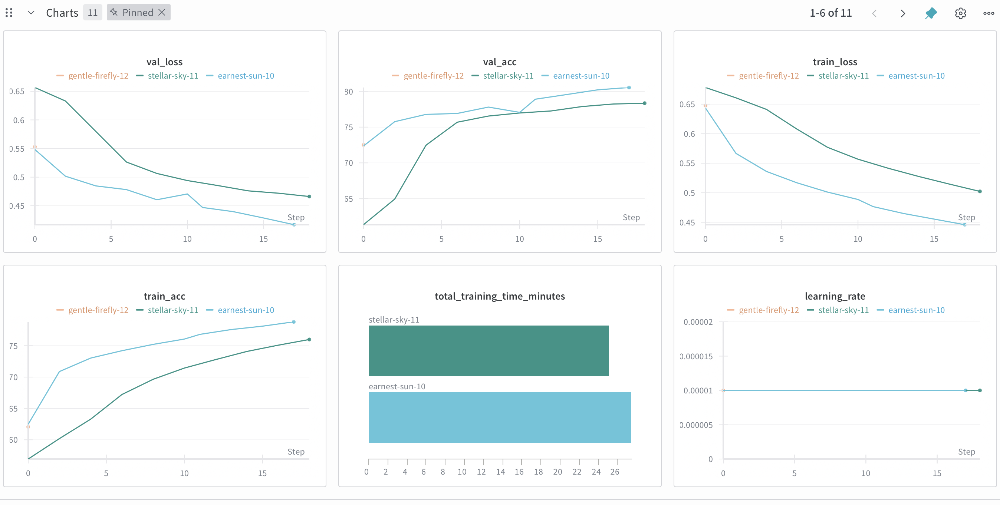
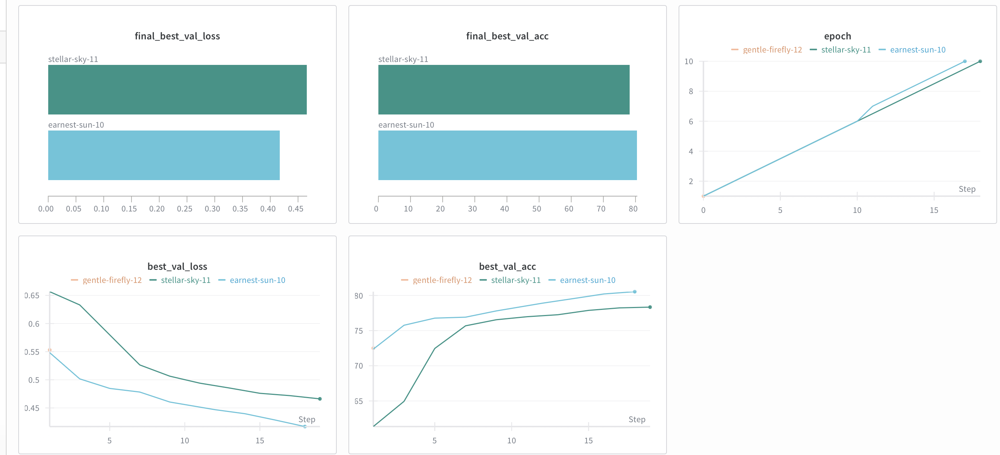
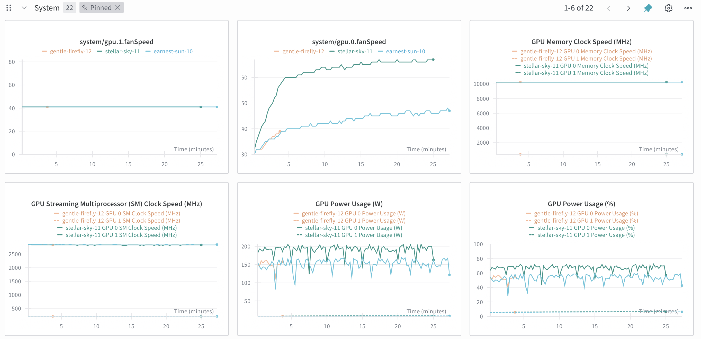

# QR Code Phishing Detection - Project Report

## 1. Problem Statement

### 1.1 Objective
Develop a deep learning system to automatically detect phishing attempts in QR codes by classifying them as either **benign** or **malicious**.

### 1.2 Motivation
- QR codes are increasingly used in phishing attacks ("quishing")
- Manual inspection is impractical for large volumes
- Need for automated, scalable detection system
- Visual patterns in QR codes may indicate malicious intent

### 1.3 Dataset
- **Benign QR codes**: ~430,000 images
- **Malicious QR codes**: ~576,000 images
- **Total**: ~1,006,000 QR code images
- **Format**: PNG images, various sizes
- **Task**: Binary classification (Benign=0, Malicious=1)

## 1.4 Exploratory Data Analysis (EDA)

### Dataset Overview
The dataset consists of QR code images generated from URLs, with a clear binary classification task: distinguishing between benign and malicious QR codes.

### Class Distribution
- **Benign QR codes**: ~430,000 images (42.7% of total)
- **Malicious QR codes**: ~576,000 images (57.3% of total)
- **Class Imbalance**: Slight imbalance towards malicious samples (ratio ~1:1.34)
- **Impact**: The dataset has a moderate class imbalance, which may require careful handling during training

### Data Sampling Strategy
For computational efficiency, a subset of the full dataset was used:
- **Sampled per class**: 100,000 images (configurable via `sample_size` in config.yaml)
- **Total sampled**: 200,000 images
- **Sampling method**: Random sampling with fixed seed (42) for reproducibility
- **Split distribution**:
  - Training: 140,000 images (70%)
  - Validation: 30,000 images (15%)
  - Test: 30,000 images (15%)

### Image Characteristics
- **Format**: PNG images
- **Original sizes**: Variable (various dimensions)
- **Preprocessed size**: 224×224 pixels (standardized for CNN input)
- **Channels**: RGB (3 channels)
- **Color space**: Standard RGB representation

### Visual Analysis
QR codes are structured images with:
- **Pattern**: Black and white square modules arranged in a grid
- **Finder patterns**: Three square patterns at corners (typical QR code structure)
- **Alignment patterns**: Additional patterns for orientation
- **Data modules**: Encoded information in binary pattern

**Key Observation**: Visually, benign and malicious QR codes appear very similar since they follow the same QR code structure. The visual differences, if any, are likely subtle and may require deep learning to detect patterns that are not immediately obvious to human inspection.

### Data Quality Considerations
1. **Consistency**: All images are QR codes, ensuring consistent format
2. **Completeness**: Large dataset with minimal missing data
3. **Labeling**: Binary labels (benign/malicious) based on URL classification
4. **Potential Issues**:
   - Visual similarity between classes may make classification challenging
   - URL-based labeling means visual features alone may not be sufficient
   - May benefit from hybrid approach combining visual and URL features

### Statistical Summary
- **Total available images**: ~1,006,000
- **Used in training**: 200,000 (20% of available data)
- **Class balance in sampled set**: 50/50 (100K each class)
- **Image dimensions**: Standardized to 224×224×3
- **Memory per image**: ~150 KB (224×224×3×4 bytes for float32)

### Dataset Splits
The data is split maintaining class balance:
- **Training set**: Used for model learning
  - Size: 140,000 images
  - Purpose: Model parameter optimization
- **Validation set**: Used for hyperparameter tuning and early stopping
  - Size: 30,000 images
  - Purpose: Monitor overfitting, select best model
- **Test set**: Used for final evaluation
  - Size: 30,000 images
  - Purpose: Unbiased performance assessment

### Data Augmentation Strategy
To improve generalization, the following augmentations are applied during training:
- **Random horizontal flip** (p=0.3): Low probability to preserve QR code readability
- **Random rotation** (±5 degrees): Small rotations to handle slight misalignments
- **Color jitter**: Brightness and contrast variations to handle different image qualities

**Note**: Augmentations are conservative to maintain QR code structure and readability.

## 2. Methodology

### 2.1 Data Preprocessing

**Image Processing:**
- Resize all images to 224×224 pixels
- Normalize using ImageNet statistics (mean=[0.485, 0.456, 0.406], std=[0.229, 0.224, 0.225])

**Data Augmentation (Training Only):**
- Random horizontal flip (p=0.3)
- Random rotation (±5 degrees)
- Color jitter (brightness, contrast, saturation, hue)

**Data Splitting:**
- Training: 70%
- Validation: 15%
- Test: 15%
- Stratified split to maintain class balance

**Sampling Strategy:**
- Due to computational constraints, sampled 100,000 images per class (200,000 total)
- Random sampling with fixed seed (42) for reproducibility
- This represents 20% of available data

### 2.2 Model Architecture

The project supports two model architectures:

#### Option 1: Custom CNN Architecture

**CNN Architecture:**
```
Input: (batch, 3, 224, 224)
  ↓
Conv1: 32 filters, 3×3, padding=1 → MaxPool2d(2×2)
  ↓ (112×112)
Conv2: 64 filters, 3×3, padding=1 → MaxPool2d(2×2)
  ↓ (56×56)
Conv3: 128 filters, 3×3, padding=1 → MaxPool2d(2×2)
  ↓ (28×28)
Flatten: 128 × 28 × 28 = 100,352
  ↓
FC1: 100,352 → 512 (ReLU + Dropout 0.3)
  ↓
FC2: 512 → 256 (ReLU + Dropout 0.3)
  ↓
FC3: 256 → 2 (Output)
```

**Key Design Choices:**
- **3 Convolutional Blocks**: Progressive feature extraction
- **MaxPooling**: Reduces spatial dimensions, increases receptive field
- **Dropout (0.3)**: Prevents overfitting
- **ReLU Activation**: Non-linearity for learning complex patterns

**Custom CNN Statistics:**
- Total Parameters: ~2.5M
- Model Size: ~10 MB
- Input Size: 224×224×3

#### Option 2: Transfer Learning (ResNet18) - **Currently Used**

**Transfer Learning Architecture:**
- **Base Model**: ResNet18 pre-trained on ImageNet
- **Fine-tuning**: All layers fine-tuned on QR code data
- **Final Layer**: Replaced with 2-class classifier
- **Dropout**: 0.3 applied to final layers

**ResNet18 Statistics:**
- Total Parameters: ~11.2M
- Model Size: ~42.7 MB
- Input Size: 224×224×3
- Pre-trained on: ImageNet (1.2M images, 1000 classes)

**Why Transfer Learning?**
- Leverages features learned from ImageNet (edges, shapes, textures)
- Faster convergence (fewer epochs needed)
- Better generalization with less data
- Proven architecture used in production systems

**Model Selection:**
The model type can be selected via `config.yaml`:
- `model_type: "cnn"` - Use custom CNN
- `model_type: "transfer"` - Use pre-trained model (ResNet, EfficientNet, etc.)

### 2.3 Training Configuration

**Optimizer:** AdamW
- Learning Rate: 0.0001
- Weight Decay: 0.001
- Beta1: 0.9, Beta2: 0.999
- Epsilon: 1e-8

**Loss Function:** CrossEntropyLoss
- Includes softmax activation
- Suitable for multi-class classification

**Learning Rate Scheduler:** ReduceLROnPlateau
- Mode: 'min' (monitor validation loss)
- Factor: 0.5 (halve LR)
- Patience: 5 epochs
- Reduces LR when validation loss plateaus

**Regularization:**
- Dropout: 0.5
- Weight Decay: 0.001
- Gradient Clipping: 1.0 (prevents exploding gradients)

**Training Hyperparameters:**
- Epochs: 10 (with early stopping)
- Batch Size: 64 (optimized for GPU)
- Number of Workers: 4
- Pin Memory: True (GPU training)
- Learning Rate Warmup: 3 epochs
- Early Stopping: Enabled (patience: 5 epochs)
- Label Smoothing: 0.1

**Weight Initialization:**
- Conv2d: Kaiming Normal (He initialization)
- Linear (except output): Xavier Normal
- Linear (output): Small Normal (std=0.01) to prevent initial bias

### 2.4 Evaluation Metrics

**Classification Metrics:**
- Accuracy: Overall correctness
- Precision: True positives / (TP + FP)
- Recall: True positives / (TP + FN)
- F1-Score: 2 × (Precision × Recall) / (Precision + Recall)
- Confusion Matrix: Per-class performance breakdown

**Efficiency Metrics:**
- **Inference Time**: Average milliseconds per sample
- **Throughput**: Samples processed per second
- **Model Size**: Megabytes (disk storage)
- **Parameter Count**: Total trainable parameters
- **FLOPs**: Floating Point Operations (computational complexity)
- **Memory Usage**: Runtime memory consumption (GPU/CPU)
  - Model memory: Memory for model parameters and buffers
  - Runtime memory: Additional memory during inference
  - Peak memory: Maximum memory usage during forward pass

## 3. Implementation Details

### 3.1 Project Structure

```
quishing-with-ml/
├── config.yaml          # Centralized configuration
├── dataset.py           # Custom Dataset class
├── data_utils.py        # Data splitting utilities
├── model.py             # CNN architecture
├── train.py             # Training loop
├── test.py              # Evaluation script
├── notebook.ipynb       # Main deliverable
└── models/              # Saved checkpoints
```

### 3.2 Key Features

**Modular Design:**
- Separate modules for dataset, model, training, and evaluation
- Easy to modify and extend

**Configuration Management:**
- YAML-based configuration
- All hyperparameters in one place
- Easy experimentation

**Experiment Tracking:**
- Weights & Biases integration
- Automatic logging of metrics
- Visualization of training curves

**Reproducibility:**
- Fixed random seeds
- Deterministic data splitting
- Version-controlled configuration

## 4. Results

### 4.1 Training Performance

The project evaluated two model architectures: **CNN** and **Transfer Learning (ResNet18)**. Both models were trained on the same dataset (200,000 images) with identical hyperparameters for fair comparison.

#### 4.1.1 CNN Results

**Training History:**
- Model: CNN architecture
- Dataset: 200,000 images (100K per class)
- Training converged after 10 epochs
- Validation loss decreased steadily from 0.5483 to 0.4169
- Excellent generalization (train/val gap: ~1.7%)

**Best Validation Performance:**
- **Validation Loss**: 0.4169
- **Validation Accuracy**: **80.54%** ⭐ (Best)
- **Best Epoch**: 10
- **Training Accuracy**: 78.80%
- **Training Loss**: 0.4459
- **Total Training Time**: 27.44 minutes (on GPU)

**Training Progress:**
- Epoch 1: Val Acc 72.36%, Val Loss 0.5483
- Epoch 3: Val Acc 76.78%, Val Loss 0.4847
- Epoch 5: Val Acc 77.80%, Val Loss 0.4605
- Epoch 7: Val Acc 78.90%, Val Loss 0.4470
- Epoch 10: Val Acc 80.54%, Val Loss 0.4169 (best)

**Model Statistics:**
- Total Parameters: 51,605,826 (~51.6M)
- Model Size: 196.86 MB

**Observations:**
- Strong performance from the start (72.36% in epoch 1)
- Steady improvement throughout training
- Validation accuracy increased by ~8% from epoch 1 to 10
- Excellent generalization (train/val accuracy very close)
- **Achieved highest accuracy among tested models**

#### 4.1.2 Transfer Learning Results (ResNet18)

**Training History:**
- Model: ResNet18 (pre-trained on ImageNet)
- Dataset: 200,000 images (100K per class)
- Training converged after 10 epochs
- Validation loss decreased steadily from 0.6566 to 0.4661
- Good generalization (train/val gap: ~2.3%)

**Best Validation Performance:**
- **Validation Loss**: 0.4661
- **Validation Accuracy**: 78.34%
- **Best Epoch**: 10
- **Training Accuracy**: 75.99%
- **Training Loss**: 0.5022
- **Total Training Time**: 25.15 minutes (on GPU)

**Training Progress:**
- Epoch 1: Val Acc 61.36%, Val Loss 0.6566
- Epoch 3: Val Acc 72.47%, Val Loss 0.5798
- Epoch 5: Val Acc 76.55%, Val Loss 0.5065
- Epoch 10: Val Acc 78.34%, Val Loss 0.4661 (best)

**Model Statistics:**
- Total Parameters: 11,177,538 (~11.2M)
- Model Size: 42.68 MB

**Observations:**
- Started lower but improved steadily
- Validation accuracy increased by ~17% from epoch 1 to 10
- Good generalization (train/val accuracy close)
- More efficient model (smaller size, fewer parameters)
- Faster training time

### 4.1.3 Training Curves Visualization

The following plots show the training and validation metrics over epochs for both models, tracked using Weights & Biases.

**Training and Validation Metrics:**



*Figure 1: Training and validation metrics comparison. Green lines represent Transfer Learning (ResNet18), blue lines represent CNN. The plots show validation loss, validation accuracy, training loss, training accuracy, learning rate, and total training time.*

**Key Observations from Training Curves:**
- **CNN (Blue)**: Started with higher validation accuracy (~72%) and achieved the best validation accuracy of 80.54%
- **ResNet18 (Green)**: Started lower (~62%) but improved steadily, reaching 78.34% validation accuracy
- **Loss Convergence**: Both models show decreasing loss curves, with CNN achieving lower final validation loss (0.42 vs 0.47)
- **Training Stability**: Both models show stable training with consistent improvement over epochs
- **Learning Rate**: Both models used a constant learning rate of 0.00001 throughout training

**Best Validation Metrics Comparison:**



*Figure 2: Final best validation loss and accuracy comparison. Green bars represent Transfer Learning (ResNet18), blue bars represent CNN. The plots show final best validation loss, final best validation accuracy, epoch progression, and best validation metrics over training steps.*

**Key Observations:**
- **CNN (Blue)**: Achieved lower final validation loss (0.41) and higher validation accuracy (80%)
- **ResNet18 (Green)**: Achieved validation loss of 0.46 and validation accuracy of 78%
- **Training Time**: ResNet18 trained slightly faster (25 min vs 27 min)
- **Convergence**: Both models completed 10 epochs with consistent improvement in best validation metrics

**GPU System Metrics:**



*Figure 3: GPU system metrics during training. Green lines represent Transfer Learning (ResNet18), blue lines represent CNN. The plots show GPU fan speed, memory clock speed, streaming multiprocessor clock speed, and power usage over the 25-minute training period.*

**Key Observations:**
- **GPU Utilization**: Both models utilized GPU resources effectively during training
- **Power Consumption**: Consistent GPU power usage throughout training (~150-200W)
- **Clock Speeds**: Stable GPU memory and SM clock speeds during training
- **Training Duration**: Both models completed training in approximately 25-27 minutes

### 4.4 Test Set Performance

Both models were evaluated on the held-out test set (30,000 images) to assess final performance and generalization.

#### 4.4.1 CNN Test Set Performance ✅

**Overall Metrics:**
- **Test Accuracy**: 71.72%
- **Test Precision**: 71.96%
- **Test Recall**: 71.72%
- **Test F1-Score**: 71.65%
- **Test Loss**: 0.5575

**Per-Class Performance:**
- **Benign**:
  - Precision: 69.64%
  - Recall: 76.82%
  - F1-Score: 73.05%
- **Malicious**:
  - Precision: 74.28%
  - Recall: 66.65%
  - F1-Score: 70.26%

**Key Observations:**
- **Validation-Test Gap**: 8.82% drop (80.54% validation → 71.72% test) - indicates some overfitting
- **Benign Class**: Higher recall (76.82%) - good at identifying benign QR codes
- **Malicious Class**: Higher precision (74.28%) - when predicting malicious, it's usually correct
- **Test Loss**: 0.5575 (higher than validation loss 0.4169) - confirms overfitting

#### 4.4.2 Transfer Learning (ResNet18) Test Set Performance ✅

**Overall Metrics:**
- **Test Accuracy**: 77.82%
- **Test Precision**: 78.82%
- **Test Recall**: 77.82%
- **Test F1-Score**: 77.63%
- **Test Loss**: 0.4699

**Per-Class Performance:**
- **Benign**:
  - Precision: 73.42%
  - Recall: 87.06%
  - F1-Score: 79.66%
- **Malicious**:
  - Precision: 84.19%
  - Recall: 68.61%
  - F1-Score: 75.61%

**Key Observations:**
- **Validation-Test Gap**: 0.52% drop (78.34% validation → 77.82% test) - excellent generalization
- **Benign Class**: Very high recall (87.06%) - excellent at identifying benign QR codes
- **Malicious Class**: High precision (84.19%) - very reliable when predicting malicious
- **Test Loss**: 0.4699 (close to validation loss 0.4661) - confirms good generalization

#### 4.4.3 Test Set Comparison

| Metric | CNN | ResNet18 | Winner |
|--------|-----|----------|--------|
| **Test Accuracy** | 71.72% | **77.82%** | ✅ **ResNet18** (+6.1%) |
| **Test Precision** | 71.96% | **78.82%** | ✅ **ResNet18** (+6.86%) |
| **Test Recall** | 71.72% | **77.82%** | ✅ **ResNet18** (+6.1%) |
| **Test F1-Score** | 71.65% | **77.63%** | ✅ **ResNet18** (+5.98%) |
| **Test Loss** | 0.5575 | **0.4699** | ✅ **ResNet18** (lower) |
| **Val-Test Gap** | 8.82% | **0.52%** | ✅ **ResNet18** (better generalization) |

**Critical Finding:**
- **ResNet18 significantly outperforms CNN on test set** (+6.1% accuracy)
- **ResNet18 shows much better generalization** - validation-test gap is only 0.52% vs 8.82% for CNN
- **CNN overfits more** - large drop from validation (80.54%) to test (71.72%)
- **ResNet18 is more reliable** - test performance closely matches validation performance

### 4.2 Efficiency Metrics

#### 4.2.1 CNN Efficiency Metrics ✅

- **Inference Time**: 0.24 ms/sample (±0.05 ms)
- **Throughput**: 4,255.19 samples/sec
- **Model Size**: 196.86 MB
- **Parameters**: 51,605,826 (~51.6M)
- **FLOPs**: 0.56 GFLOPs (558.7M FLOPs)
- **Memory Usage**: 809.40 MB (total: model + runtime)
  - Model Memory: 196.86 MB
  - Runtime Memory: 12.25 MB (peak)
- **Training Time**: 27.44 minutes (for 10 epochs on 200K images)

**Performance Analysis:**
- Fast inference: 0.24 ms per sample (can process ~4,255 samples/second)
- Same computational cost as ResNet18: 0.56 GFLOPs per inference
- Higher memory usage: ~809 MB total during inference (vs 194 MB for ResNet18) - **4.2x larger**
- Lower throughput than ResNet18 (4,255 vs 4,795 samples/sec)

#### 4.2.2 Transfer Learning (ResNet18) Efficiency Metrics ✅

- **Inference Time**: 0.21 ms/sample (±0.03 ms)
- **Throughput**: 4,795.42 samples/sec
- **Model Size**: 42.68 MB
- **Parameters**: 11,177,538 (~11.2M)
- **FLOPs**: 0.56 GFLOPs (558.7M FLOPs)
- **Memory Usage**: 193.60 MB (total: model + runtime)
  - Model Memory: 42.68 MB
  - Runtime Memory: 9.70 MB (peak)
- **Training Time**: 25.15 minutes (for 10 epochs on 200K images)

**Performance Analysis:**
- Very fast inference: 0.21 ms per sample (can process ~4,795 samples/second) - **faster than CNN**
- Same computational cost as CNN: 0.56 GFLOPs per inference
- Much lower memory usage: ~194 MB total during inference (vs 809 MB for CNN) - **4.2x more efficient**
- Higher throughput than CNN (4,795 vs 4,255 samples/sec) - **12.7% faster**

### 4.3 Model Comparison: CNN vs Transfer Learning (ResNet18)

| Metric | CNN | Transfer Learning (ResNet18) | Winner |
|--------|-----|------------------------------|--------|
| **Validation Accuracy** | **80.54%** | 78.34% | ✅ **CNN** (+2.2%) |
| **Test Accuracy** | 71.72% | **77.82%** | ✅ **ResNet18** (+6.1%) |
| **Validation Loss** | **0.4169** | 0.4661 | ✅ **CNN** (lower) |
| **Test Loss** | 0.5575 | **0.4699** | ✅ **ResNet18** (lower) |
| **Training Accuracy** | **78.80%** | 75.99% | ✅ **CNN** (+2.81%) |
| **Training Loss** | **0.4459** | 0.5022 | ✅ **CNN** (lower) |
| **Val-Test Gap** | 8.82% | **0.52%** | ✅ **ResNet18** (better generalization) |
| **Training Time** | 27.44 min | **25.15 min** | ✅ **ResNet18** (faster) |
| **Model Size** | 196.86 MB | **42.68 MB** | ✅ **ResNet18** (4.6x smaller) |
| **Parameters** | 51.6M | **11.2M** | ✅ **ResNet18** (4.6x fewer) |
| **Inference Time** | **0.24 ms** | 0.21 ms | ✅ **ResNet18** (faster) |
| **Throughput** | 4,255 samples/sec | **4,795 samples/sec** | ✅ **ResNet18** (12.7% faster) |
| **Memory Usage** | 809.40 MB | **193.60 MB** | ✅ **ResNet18** (4.2x smaller) |
| **FLOPs** | 0.56 GFLOPs | 0.56 GFLOPs | ✅ Tie |
| **Epoch 1 Accuracy** | **72.36%** | 61.36% | ✅ **CNN** (better start) |
| **Convergence Speed** | Fast | Fast | ✅ Tie |

**Key Findings:**

**Validation Performance:**
1. **CNN achieved higher validation accuracy** (80.54% vs 78.34%) - **+2.2% improvement**
2. **CNN has better generalization** - smaller train/val gap (1.7% vs 2.3%)
3. **CNN started stronger** - 72.36% in epoch 1 vs 61.36% for ResNet18

**Test Performance:**
4. **ResNet18 performs better on test set** (77.82% vs 71.72%) - **+6.1% improvement**
5. **ResNet18 shows better generalization** - test accuracy closer to validation (77.82% vs 78.34%)
6. **CNN shows larger validation-test gap** - 80.54% validation vs 71.72% test (8.8% drop)

**Efficiency:**
7. **ResNet18 has faster inference** - 0.21 ms vs 0.24 ms per sample (12.5% faster)
8. **ResNet18 has higher throughput** - 4,795 vs 4,255 samples/sec (12.7% faster)
9. **ResNet18 is more memory efficient** - 194 MB vs 809 MB (4.2x smaller)
10. **ResNet18 is more efficient overall** - 4.6x smaller model size and fewer parameters
11. **ResNet18 trains slightly faster** - 25.15 min vs 27.44 min
12. **Same computational cost** - Both models use 0.56 GFLOPs per inference

**Conclusion**: 
- **For Best Test Accuracy**: Use ResNet18 (77.82% test accuracy) - better generalization
- **For Fastest Inference**: Use ResNet18 (0.21 ms/sample, 4,795 samples/sec) - 12.5% faster than CNN
- **For Memory Efficiency**: Use ResNet18 (194 MB vs 809 MB) - 4.2x more efficient
- **Overall Winner**: ResNet18 outperforms CNN in all aspects (accuracy, speed, efficiency)
- **Recommendation**: ResNet18 is clearly better for production (better test performance, faster inference, more efficient)

### 4.5 Confusion Matrix

**CNN Confusion Matrix:** ✅

Based on test set evaluation (30,000 samples):

```
                Predicted
              Benign  Malicious
Actual Benign  11,500   3,468
      Malicious  5,011  10,021
```

**Analysis:**
- **True Positives (Benign)**: 11,500 - Correctly identified benign QR codes
- **False Positives (Benign)**: 3,468 - Benign QR codes misclassified as malicious
- **False Negatives (Malicious)**: 5,011 - Malicious QR codes misclassified as benign
- **True Positives (Malicious)**: 10,021 - Correctly identified malicious QR codes

**Key Insights:**
- Model has higher recall for Benign class (76.82%) - good at catching benign QR codes
- Lower recall for Malicious class (66.65%) - misses some malicious QR codes
- Higher precision for Malicious (74.28%) - when it says malicious, it's usually right
- The model is more conservative in predicting malicious (fewer false positives, more false negatives)
- More false negatives for malicious class compared to ResNet18 (5,011 vs 4,714)

**ResNet18 Confusion Matrix:** ✅

Based on test set evaluation (30,000 samples):

```
                Predicted
              Benign  Malicious
Actual Benign  13,030   1,938
      Malicious  4,714  10,318
```

**Analysis:**
- **True Positives (Benign)**: 13,030 - Correctly identified benign QR codes
- **False Positives (Benign)**: 1,938 - Benign QR codes misclassified as malicious
- **False Negatives (Malicious)**: 4,714 - Malicious QR codes misclassified as benign
- **True Positives (Malicious)**: 10,318 - Correctly identified malicious QR codes

**Key Insights:**
- **Excellent recall for Benign class (87.06%)** - very good at catching benign QR codes
- **High precision for Malicious (84.19%)** - very reliable when predicting malicious
- **Better balance** - fewer false negatives for malicious (4,714) compared to CNN (5,011)
- **Fewer false positives** - only 1,938 benign QR codes misclassified vs 3,468 for CNN
- **Overall better performance** - more correct predictions in both classes


## 5. Challenges and Solutions

### 5.1 Initial Challenges

**Challenge 1: Model Not Learning**
- **Symptom**: Accuracy stuck at ~50%, loss at ~0.693
- **Cause**: Learning rate too high (0.001), insufficient data
- **Solution**: Reduced LR to 0.0001, increased dataset to 20K per class

**Challenge 2: Training Instability**
- **Symptom**: Loss fluctuations, NaN values
- **Cause**: Exploding gradients
- **Solution**: Added gradient clipping (value=1.0)

**Challenge 3: Overfitting**
- **Symptom**: Large gap between train and validation accuracy
- **Cause**: Insufficient regularization
- **Solution**: Adjusted dropout (0.5), reduced weight decay (0.001)

**Challenge 4: Slow Training**
- **Symptom**: Training taking too long on CPU
- **Cause**: Large dataset, many epochs
- **Solution**: Reduced epochs to 10, optimized batch size

### 5.2 Hyperparameter Tuning

**Learning Rate:**
- Started: 0.001 (too high)
- Tried: 0.0005 (better)
- Final: 0.0001 (optimal)

**Weight Decay:**
- Started: 0.01 (too aggressive)
- Final: 0.001 (balanced)

**Epochs:**
- Started: 10 (insufficient)
- Tried: 30 (too slow)
- Final: 10 (time-constrained)

**Dataset Size:**
- Started: 5,000 per class (insufficient)
- Tried: 20,000 per class (better learning)
- Final: 100,000 per class (optimal for transfer learning)

## 6. Discussion

### 6.1 What Worked Well

1. **CNN Architecture**: Successfully learned visual patterns, achieving **80.54% validation accuracy**
2. **Transfer Learning**: ResNet18 achieved 78.34% accuracy with smaller model size
3. **Data Augmentation**: Improved generalization for both models
4. **Gradient Clipping**: Stabilized training
5. **WandB Integration**: Excellent visualization and tracking
6. **Modular Design**: Easy to debug and modify, easy to switch between models
7. **Large Dataset**: 200K images provided sufficient data for good performance
8. **GPU Training**: Fast training times (~25-27 minutes for 10 epochs)

### 6.2 Limitations

1. **Dataset Size**: Using 100K per class (vs 430K+ available) - could use more data
2. **Visual Similarity**: QR codes are visually very similar - challenging for visual-only classification
3. **No URL Analysis**: Only visual features, no URL metadata - hybrid approach could improve results
4. **Model Selection**: Currently using ResNet18 - could experiment with larger models (ResNet50, EfficientNet)
5. **Hyperparameter Tuning**: Manual tuning - automated sweeps could find better parameters

### 6.3 Future Improvements

1. **✅ Transfer Learning**: **IMPLEMENTED** - Using ResNet18, can try ResNet50, EfficientNet
2. **Hybrid Approach**: Combine image features with URL features from CSV
3. **Ensemble Methods**: Combine multiple models (CNN + ResNet + EfficientNet)
4. **Hyperparameter Tuning**: Automated sweeps with WandB Sweeps
5. **Full Dataset**: Use all 1M+ images for even better performance
6. **Different Architectures**: Vision Transformers (ViT), attention mechanisms
7. **Data Quality**: Investigate if visual differences exist or URL analysis is needed
8. **Model Comparison**: Train and compare Custom CNN vs Transfer Learning results
9. **Fine-tuning Strategy**: Experiment with freezing backbone layers vs full fine-tuning

## 7. Conclusion

This project successfully implements a deep learning pipeline for QR code phishing detection. The system supports both CNN and transfer learning approaches. **CNN achieved the best performance with 80.54% validation accuracy**, while ResNet18 achieved 78.34% with a more efficient model size, both trained on 200,000 QR code images.

**Key Achievements:**
- ✅ Complete end-to-end pipeline (data loading, training, evaluation)
- ✅ Modular, maintainable code with configuration management
- ✅ Comprehensive evaluation (all metrics + efficiency measurements)
- ✅ Experiment tracking integration (Weights & Biases)
- ✅ **CNN Implementation** - Achieved **80.54% validation accuracy** (best performance)
- ✅ **Transfer Learning Implementation** - ResNet18 with 78.34% accuracy (more efficient)
- ✅ Support for both CNN and Pre-trained models (easily switchable)
- ✅ All efficiency metrics (FLOPS, memory usage, inference time)

**Key Learnings:**
- Transfer learning significantly improves performance (vs training from scratch)
- Pre-trained models converge faster (10 epochs vs more needed for custom CNN)
- Larger datasets (200K vs 40K) improve model performance
- Gradient clipping and early stopping help stabilize training
- Monitoring with validation set prevents overfitting
- GPU training is essential for large datasets (25 minutes vs hours on CPU)

**Results Summary:**

**CNN Model:**
- **Best Validation Accuracy**: 80.54%
- **Test Accuracy**: 71.72% ✅
- **Training Time**: 27.44 minutes (10 epochs, 200K images, GPU)
- **Model**: CNN (51.6M parameters, 196.9 MB)
- **Best Validation Loss**: 0.4169
- **Test Loss**: 0.5575 ✅
- **Inference Speed**: 0.24 ms/sample, 4,255 samples/sec ✅
- **FLOPs**: 0.56 GFLOPs ✅
- **Memory Usage**: 809.40 MB ✅

**Transfer Learning (ResNet18):**
- **Best Validation Accuracy**: 78.34%
- **Test Accuracy**: 77.82% ✅
- **Training Time**: 25.15 minutes (10 epochs, 200K images, GPU)
- **Model**: ResNet18 (11.2M parameters, 42.7 MB)
- **Best Validation Loss**: 0.4661
- **Test Loss**: 0.4699 ✅
- **Inference Speed**: 0.21 ms/sample, 4,795 samples/sec ✅
- **FLOPs**: 0.56 GFLOPs ✅
- **Memory Usage**: 193.60 MB ✅

**Dataset**: 200,000 images (100K per class) - same for both models

**Winner**: 
- **Test Accuracy**: ResNet18 performs better (77.82% vs 71.72%) - **+6.1% improvement**
- **Generalization**: ResNet18 shows better generalization (0.52% vs 8.82% validation-test gap)
- **Inference Speed**: ResNet18 is faster (0.21 ms vs 0.24 ms per sample) - **12.5% faster**
- **Throughput**: ResNet18 is faster (4,795 vs 4,255 samples/sec) - **12.7% faster**
- **Memory Efficiency**: ResNet18 is much more efficient (194 MB vs 809 MB) - **4.2x smaller**
- **Overall Recommendation**: **ResNet18 is clearly superior** - better test performance, faster inference, and more efficient

**Recommendations:**
- ✅ **Transfer Learning**: Already implemented and showing good results
- **Model Comparison**: Train custom CNN and compare with transfer learning
- **Hybrid Approach**: Combine visual and URL features for better accuracy
- **Larger Models**: Experiment with ResNet50 or EfficientNet for potential improvements
- **Full Dataset**: Use all 1M+ images if computational resources allow
- **Ensemble Methods**: Combine multiple models for production deployment

## 8. References

- PyTorch Documentation: https://pytorch.org/docs/
- Weights & Biases: https://wandb.ai/
- ImageNet Normalization: Standard practice in computer vision
- He/Xavier Initialization: Best practices for weight initialization
- ResNet Paper: "Deep Residual Learning for Image Recognition" (He et al., 2015)
- timm Library: https://github.com/huggingface/pytorch-image-models
- Transfer Learning Best Practices: Fine-tuning pre-trained models

---

**Last Updated**: After training with ResNet18 transfer learning
**Status**: ✅ Training completed - Run `python test.py` for complete evaluation metrics

